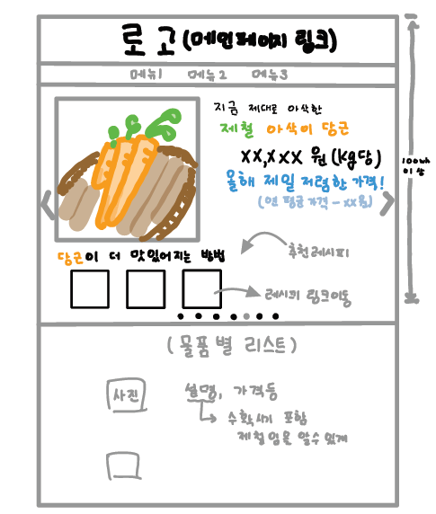
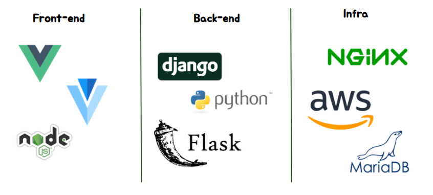
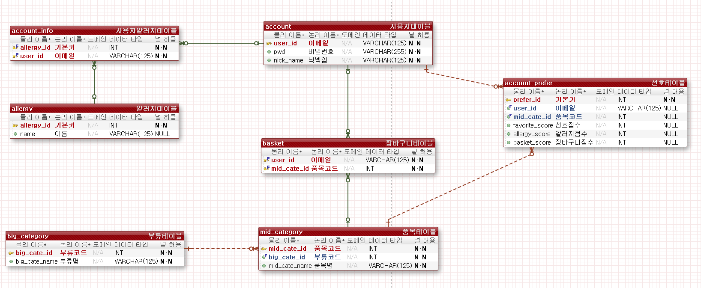

# 제철의 광장
> 빅데이터 503팀 3.3.3

## :pushpin: 목차
- [개요](#개요)
	- [와이어프레임](#와이어프레임)
- [기능](#기능)
- [기술 스택](#기술-스택)
- [기술 설명](#기술-설명)
	- [ERD](#erd)
	- [시스템 구성도](#시스템-구성도)

## :clipboard: 개요
> 저렴한 제철 농수산물을 이용한 레시피 추천 웹 서비스
- 배포 URL: [http://j3a503.p.ssafy.io/](http://j3a503.p.ssafy.io/)

### 와이어프레임
> 상세 와이어프레임은 docs/wireframe 폴더 참조

- 메인 페이지 와이어프레임

## :scroll: 기능
- 가격, 제철 시기, 사용자의 알레르기, 비건 정보를 고려한 농수산물 추천
- 추천된 농수산물을 활용한 레시피 추천
- 레시피 재료 체크를 위한 장바구니 기능
- 레시피의 예상 가격 계산

## :books: 기술 스택

## :memo: 기술 설명

### ERD
> ver 1.0 (20.09.17)

### 시스템 구성도

