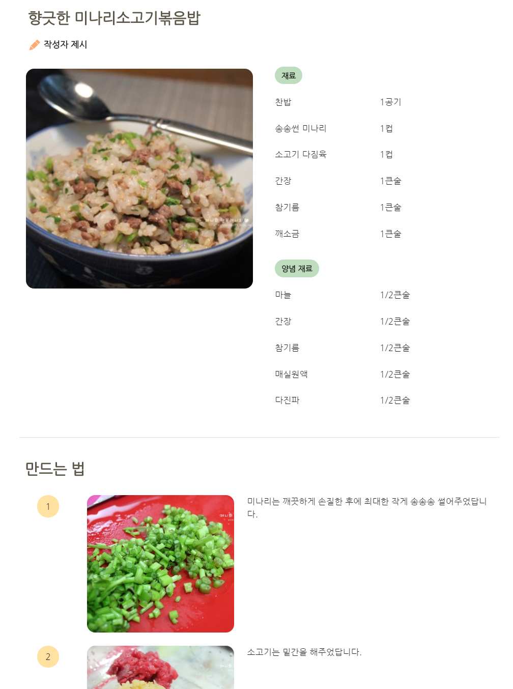
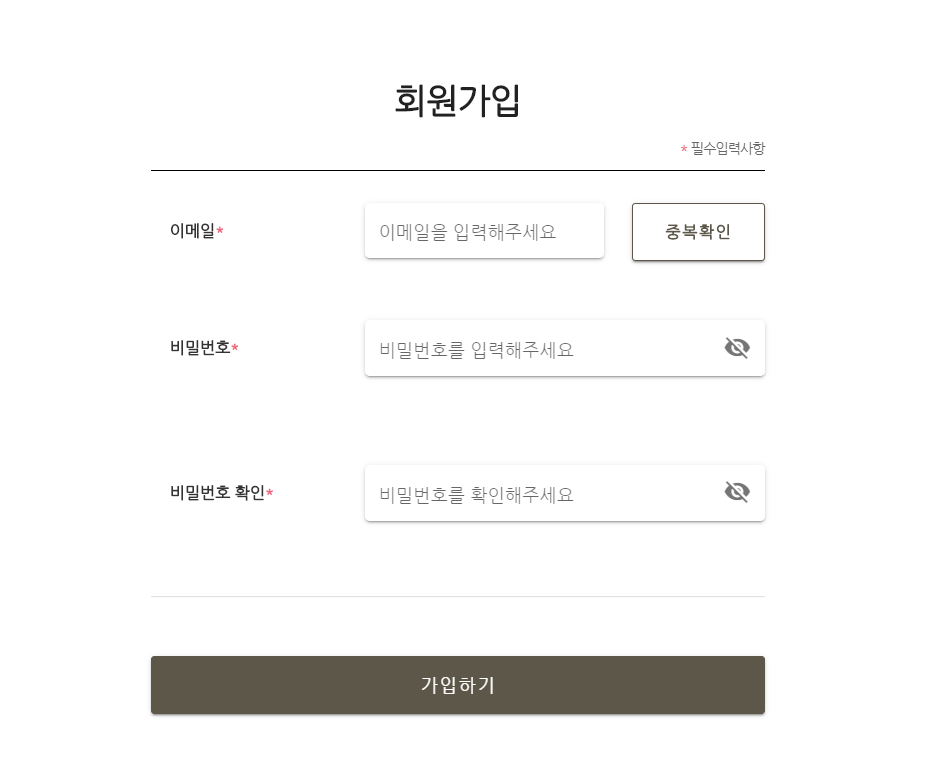
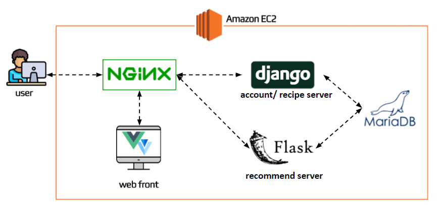

# 제철의 광장
 

> SSAFY 3기 5반 빅데이터 3팀 3.3.3

## 개요
> 저렴한 제철 농수산물을 이용한 사용자 맞춤 레시피 추천 웹 서비스
- 배포 URL: [http://j3a503.p.ssafy.io/](http://j3a503.p.ssafy.io/)

## :scroll: 기능
### :eggplant: 가격, 제철 시기, 사용자의 알레르기 및 비건 정보를 고려한 농수산물 추천

- 메인 농수산물 추천

- 더 많은 맞춤 농수산물 추천

### :tomato: 추천된 농수산물을 활용한 사용자 맞춤 레시피 추천

- 현재 레시피와 유사한 레시피/색다른 레시피 추천

- 레시피 상세 보기

- 추천 농수산물을 이용한 레시피 목록

### :pear: 레시피 재료 체크를 위한 장바구니 기능

- 레시피 재료중 없는 재료를 장바구니에 담기

- 전체 장바구니

### :peach: 회원 정보 기능

- 로그인

- 회원가입

- 비건 및 알레르기 정보 수정

## :books: 기술 스택

|기술 |버전 |
|-------|-------|
|JDK |1.8.0_265 |
|Vue.js |2.6.11 |
|Node.js|12.18.3 |
|NGINX  |1.14.0 |
|Docker |19.03.12 |
|Python |3.7.9 |
|Django |3.1.1 |
|Flask|1.1.2 |

## 시스템 구성도

## :runner: 팀 구성
|이름|역할|개발 내용|
|----|------|-----|
|서정하|Front-end|레시피 및 장바구니 화면|
|박지은|Front-end|메인 및 유저 화면|
|이진석|Back-end|레시피 크롤링 및 DB 구축|
|조원빈|Back-end|레시피 추천 기능|
|진슬기|Back-end|작물 추천 서버 및 배포|
|홍두표|Back-end|유저 기능 및 서버 배포|