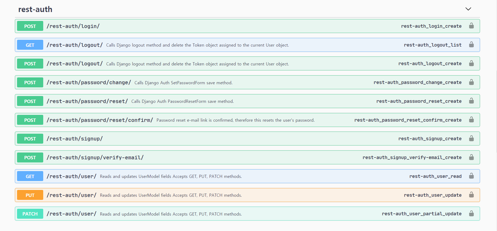
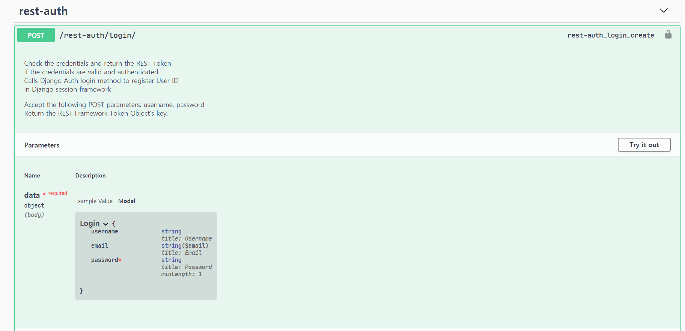
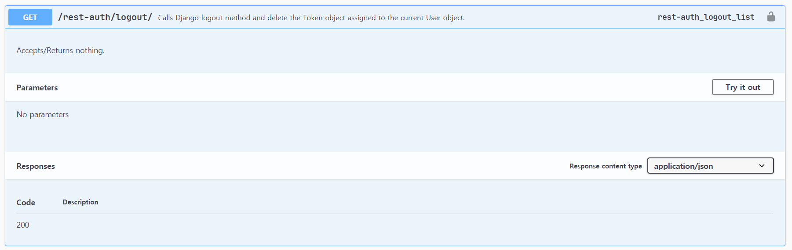
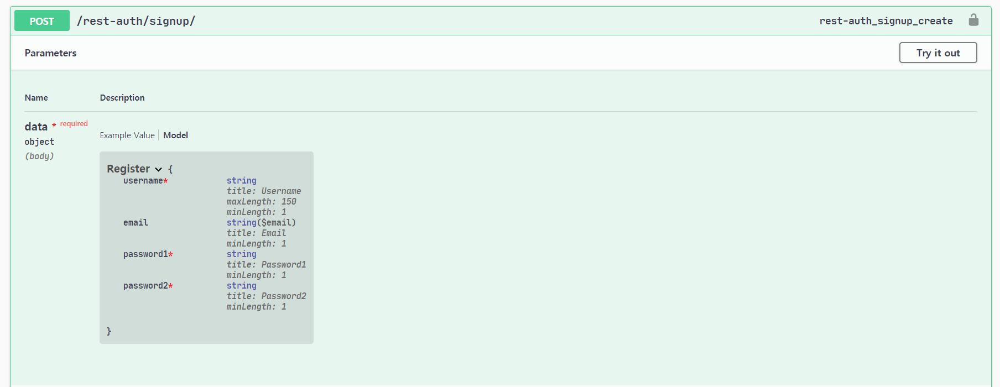
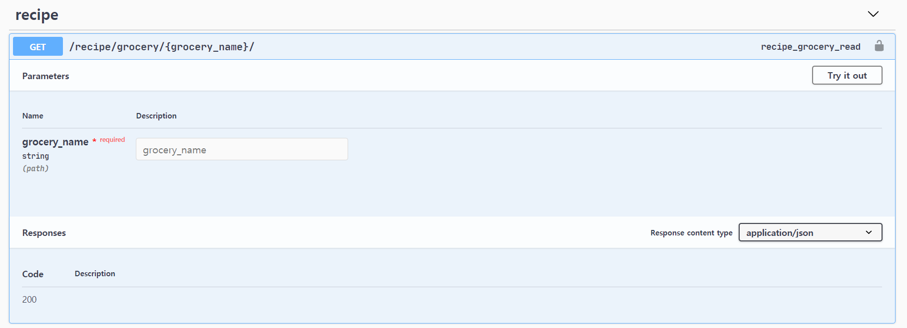
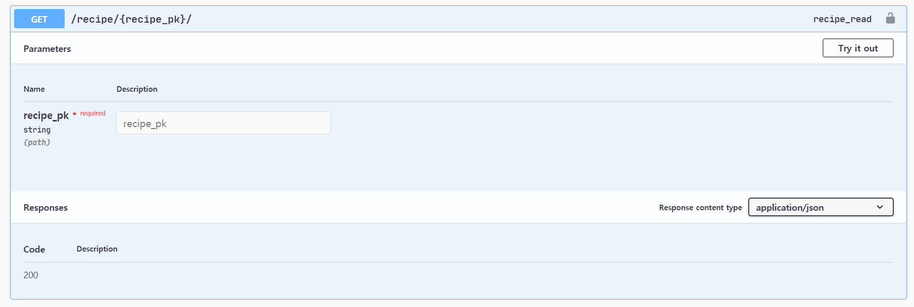

- http://j3a503.p.ssafy.io/api/rest-auth/login/



- http://j3a503.p.ssafy.io/api/rest-auth/logout/
  - 로그아웃 기능



- http://j3a503.p.ssafy.io/api/rest-auth/signup/
  - 회원가입 기능



- http://j3a503.p.ssafy.io/api/recipe/grocery/{str : grocery_name}/

  재료에 따른 레시피 출력




- http://j3a503.p.ssafy.io/api/recipe/{int : recipe_pk}/

  회원 번호에 따른 레시피 출력




# 이번주에 한 일

### back-end

- jwt를 활용한 로그인 구현
- CORS 문제 해결

```python
# CORS 문제 해결
CORS_ORIGIN_ALLOW_ALL = False
CORS_ALLOW_CREDENTIALS = True

CORS_ALLOW_METHODS = (
    'DELETE',
    'GET',
    'OPTIONS',
    'PATCH',
    'POST',
    'PUT',
)

CORS_ALLOW_HEADERS = (
    'accept',
    'accept-encoding',
    'authorization',
    'content-type',
    'dnt',
    'origin',
    'user-agent',
    'x-csrftoken',
    'x-requested-with',
)

CORS_ORIGIN_WHITELIST = [
    'http://localhost:8080',
    'http://wouldyouci.ga',
    'https://wouldyouci.ga'
]

 # jwt 인증 추가
REST_FRAMEWORK = {
    'DEFAULT_PERMISSION_CLASSES': (
        'rest_framework.permissions.AllowAny',
        # 'rest_framework.permissions.IsAuthenticated',
    ),
    
    'DEFAULT_AUTHENTICATION_CLASSES': (
        'rest_framework_jwt.authentication.JSONWebTokenAuthentication',
        # 'rest_framework.authentication.SessionAuthentication',
        # 'rest_framework.authentication.BasicAuthentication',
    ),
}
# Password 암호화 DB 저장
JWT_AUTH = {
    'JWT_SECRET_KEY': SECRET_KEY,
    'JWT_ALGORITHM': 'HS256',
    'JWT_ALLOW_REFRESH': True,
    'JWT_VERIFY' : False,
    'JWT_EXPIRATION_DELTA': datetime.timedelta(days=7),
    'JWT_REFRESH_EXPIRATION_DELTA': datetime.timedelta(days=28),
}

SITE_ID = 1

AUTH_USER_MODEL = 'accounts.User'
```

- docker로 db 컨테이너 만들어서 django 연결

```python
DATABASES = {
    'default': {
        # 'ENGINE': 'django.db.backends.sqlite3',
        # 'NAME': BASE_DIR / 'db.sqlite3',
        
        'ENGINE': 'django.db.backends.mysql',
        'NAME': 'seasonal_square',
        'USER': 'root',
        'PASSWORD': 'ssafy',
        'HOST': '127.0.0.1',
        'PORT': '3306',
    }
}
```


### ubuntu

- pyenv를 통한 python 환경변수 설정 구현

- gunicorn을 활용한 wsgi구현
  - gunicorn.service

```shell
[Unit]
Description=gunicorn daemon
After=network.target

[Service]
User=ubuntu
Group=ubuntu
WorkingDirectory=/home/ubuntu/s03p23a503/backend/WEB
ExecStart=/home/ubuntu/s03p23a503/backend/WEB/venv/bin/gunicorn --accesslogfile - --workers 3 --bind unix:/home/ubuntu/s03p23a503/backend/WEB/WEB.sock WEB.wsgi:application

[Install]
WantedBy=multi-user.target

```

- nginx settings

```json
server {
	listen 80 default_server;
	listen [::]:80 default_server;
	root /home/ubuntu/distrubution/app;
	index index.html index.htm;
	server_name t3coach17.p.ssafy.io;
	location / {
		try_files $uri $uri/ /index.html;
	}
	location /api {
		root /home/ubuntu/s03p23a503/backend/WEB;
		rewrite ^/api(/.*)$ $1 break;
		proxy_pass http://unix:/home/ubuntu/distrubution/distribution/distribution.sock;
	}
	location /admin/ {
		root /home/ubuntu/s03p23a503/backend/WEB;
		proxy_pass http://unix:/home/ubuntu/distrubution/distribution/distribution.sock;
	}
}
```

